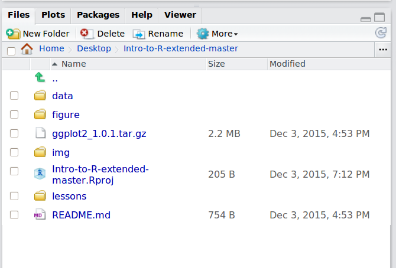

## Learning Objectives

* An introduction to R and RStudio
* Creating a directory structure for efficient data management
* Learning how to interact with R

## What is R?

R is a versatile, open source programming/scripting language that's useful both
for statistics but also data science. Inspired by the programming language S.

* Open source software under GPL.
* Superior (if not just comparable) to commercial alternatives. R has over 7,000
  user contributed packages at this time. It's widely used both in academia and
  industry.
* Available on all platforms.
* Not just for statistics, but also general purpose programming.
* For people who have experience in programmming: R is both an object-oriented
  and a so-called [functional language](http://adv-r.had.co.nz/Functional-programming.html)
* Large and growing community of peers.

## Presentation of RStudio

RStudio is freely available open-source IDE (Integrated Development Environment). It is a great alternative to working on R in the terminal for many reasons:

* automatic syntax highlighting/formatting in the editor
* direct code execution from editor to console
* real-time access to environment, plotting and history
* good tool for workspace management

**The RStudio interface has four main panels:**

1. Console: where you can type commands and see output
2. Editor: where you can type out commands and save to file. You can also run in console with `Ctrl + Enter`
3. Workspace/History: workspace shows all active objects and history keeps track of all commands run in console
4. Files/Plots/Packages/Help

## Before we get started

The instructions below are for students who have downloaded the `Intro-to-R-extended-master.zip` prior to class. If you do not have this zip file please check the README file for this repo on what you need to get started.

* Move the `Intro-to-R-extended-master.zip` to your Dektop and extract contents. You should now have a directory by the same name on your Desktop.
* Open up RStudio
* Under the `File` menu, click on `New project`, choose `New directory`, then
  `Existing Directory`
* Use `Browse...` to locate the `Intro-to-R-extended-master` directory and then `Create Project`. This will be your **working directory** for the rest of the day
  (e.g., `~/Desktop/Intro-to-R-exetended-master`)

Your working directory should now look like this:

 
* Create a new R script (File > New File > R script) and save it in your working
  directory (e.g. `intro-to-Rscript.R`). Here, you can type all the commands we run during the workshop, and save it for later reference.

## Best practices

* Code and workflow are more reproducible if we can document everything that we do.
* Our end goal is not just to "do stuff", but to do it in a way that anyone can easily and exactly replicate our workflow and results. 
* All code should be written in the editor and saved to file, rather than working in the console. The R console should be used to inspect objects, test a function or get help. 
* Use `#` signs to comment. **Comment liberally** in your R scripts. This will help future you and other collabrators know what each line of code (or code block) was meant to do. Anything to the right of a `#` is ignored by R. A shortcut for this is `Ctrl + Shift + C` if you want to comment an entire chunk of text.

### Organizing your working directory

You should separate the original data (raw data) from intermediate datasets that
you may create for the need of a particular analysis. For instance, you may want
to create a `data/` directory within your working directory that stores the raw
data, and have a `results/` directory for intermediate datasets and a
`figures/` directory for the plots you will generate.

> The current working directory has a `data` and `figure` folder already. Create an additional directory called `results`. You can do this by navigating to the lower right panel and using the `New Folder` button in the `Files` tab.

## Interacting with R

There are two main ways of interacting with R: using the console or by using
script files (plain text files that contain your code).

The console window (in RStudio, the bottom left panel) is the place where R is
waiting for you to tell it what to do, and where it will show the results of a
command.  You can type commands directly into the console, but they will be
forgotten when you close the session. It is better to enter the commands in the
script editor, and save the script. This way, you have a complete record of what
you did, you can easily show others how you did it and you can do it again later
on if needed. You can copy-paste into the R console, but the Rstudio script
editor allows you to 'send' the current line or the currently selected text to
the R console using the `Ctrl-Enter` shortcut.

### Command prompt

If R is ready to accept commands, the R console shows a `>` prompt. If it
receives a command (by typing, copy-pasting or sent from the script editor using
`Ctrl-Enter`), R will try to execute it, and when ready, show the results and
come back with a new `>`-prompt to wait for new commands.

If R is still waiting for you to enter more data because it isn't complete yet,
the console will show a `+` prompt. It means that you haven't finished entering
a complete command. This is because you have not 'closed' a parenthesis or
quotation. If you're in Rstudio and this happens, click inside the console
window and press `Ctrl+c`; this should help you out of trouble.

---
*The materials used in this lesson is adapted from work that is Copyright © Data Carpentry (http://datacarpentry.org/). 
All Data Carpentry instructional material is made available under the [Creative Commons Attribution license](https://creativecommons.org/licenses/by/4.0/) (CC BY 4.0).*

