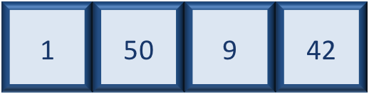
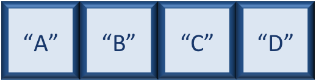
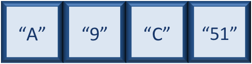
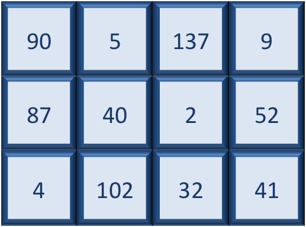
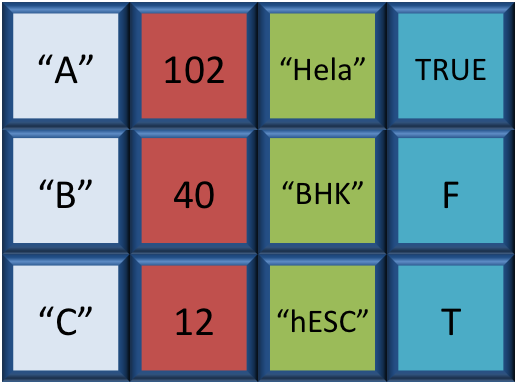
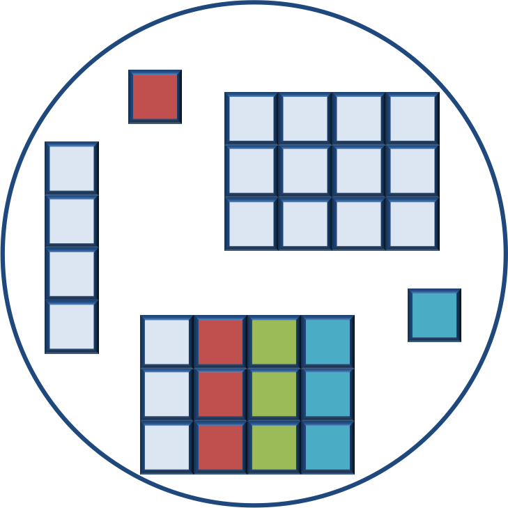

## Learning Objectives

* Become familiar with R syntax
* Understand variables and the assignment operator in R
* Understand the various data types and data structures in R


## The R syntax

### Example script

```{r example-script}

# Load libraries
library(Biobase)
library(limma)
library(ggplot2)

# Setup directory variables
baseDir <- getwd()
dataDir <- file.path(baseDir, "data")
metaDir <- file.path(baseDir, "meta")
resultsDir <- file.path(baseDir, "results")

# Load data
meta <- read.delim(file.path(metaDir, '2015-1018_sample_key.csv'), header=T, sep="\t", row.names=1)
```

* The above snippet of R code has many different "parts of speech" for R (syntax):
  - the **comments** `#` and how they are used to document function and its content
  - the **assignment operator** `<-`
  - **variables** and **functions**
  - the `=` for **arguments** in functions

_NOTE: indentation and consistency in spacing to improve clarity and legibility_


You can get output from R simply by typing in math in the console. Test it out:

```{r, purl=FALSE}
3 + 5
12/7
```

We can also type it in the editor and add comments to explain what it is we're doing. Use the R shortcuts to run it directly in the console.

```{r, purl=FALSE}
# I am adding 3 and 5. R is fun!
3+5
```

What happens if we do that same command without the comments? Re-run the command after removing the # sign in the front:

```{r, purl=FALSE, eval=FALSE}
I am adding 3 and 5. R is fun!
3+5
```

Now R is trying to run that sentence as a command, and it 
doesn't work. We get an error in the console *"Error: unexpected symbol in "I am" means that the R interpreter did not know what to do with that command."*

Ok so it's great that R is a glorified caluculator, but obviously
we want to do more interesting things. 

To do useful and interesting things, we need to assign _values_ to
_variables_. 


## Assignment operator

`<-` is the assignment operator. It assigns values on the right to variables on
the left. So, after executing `x <- 3`, the value of `x` is `3`. The arrow can
be read as 3 **goes into** `x`.  

*In RStudio, typing `Alt + -` (push `Alt` at the same time as the `-` key) will write ` <- ` in a single keystroke.*


## Variables

A variable is a symbolic name for (or reference to) information. Variables in computer programming are analogous to "buckets", where information can be maintained and referenced. On the outside of the bucket is a name. When referring to the bucket, we use the name of the bucket, not the data stored in the bucket.

In the example above, we created a variable or a 'bucket' called `x`. Inside we put a value. Let's create another variable called `y`and give it a value of 5. When assigning a value to an variable, R does not print anything to the console. You can force to
print the value by using parentheses or by typing the variable name.

```
y <- 5
```

Now we can reference these buckets by name to perform mathematical operations on the values contained within. What do you get in the console? 

```
x + y
```

Try assigning the results of this operation to another variable called `number`. 

```
number <- x + y
```

***
**Exercise**

1. Try changing the value of the variable `x` to 5. What happens to `number`?
2. Now try changing the value of variable `y` to contain the value 10. What do you need to do, to update the variable `number`?

***

> ### Notes on variables
> Variables can be given any name such as `x`, `current_temperature`, or
> `subject_id`. You want your variable names to be explicit and not too long. They
> cannot start with a number (`2x` is not valid but `x2` is). R is case sensitive
> (e.g., `genome_length` is different from `Genome_length`). There are some names that
> cannot be used because they represent the names of fundamental functions in R
> (e.g., `if`, `else`, `for`, see [here](https://stat.ethz.ch/R-manual/R-devel/library/base/html/Reserved.html)
> for a complete list). In general, even if it's allowed, it's best to not use
> other function names (e.g., `c`, `T`, `mean`, `data`) as variable names. When in doubt
> check the help to see if the name is already in use. It's also best to avoid
> dots (`.`) within a variable name as in `my.dataset`. There are many functions
> in R with dots in their names for historical reasons, but because dots have a
> special meaning in R (for methods) and other programming languages, it's best to
> avoid them. It is also recommended to use nouns for variable names, and verbs
> for function names. It's important to be consistent in the styling of your code
> (where you put spaces, how you name variable, etc.). In R, two popular style
> guides are [Hadley Wickham's style guide](http://adv-r.had.co.nz/Style.html) and [Google's](https://google-styleguide.googlecode.com/svn/trunk/Rguide.xml).


## Data Types

Variables can contain values of specific types within R. The six **data types** that R uses include: 

* `"character"` for text values, denoted by using quotes ("") around value
* `"numeric"` for any numerical value    
* `"logical"` for `TRUE` and `FALSE` (the boolean data type)
* `"integer"` for integer numbers (e.g., `2L`, the `L` indicates to R that it's an integer)
* `"complex"` to represent complex numbers with real and imaginary parts (e.g.,
  `1+4i`) and that's all we're going to say about them
* `"raw"` that we won't discuss further

The table below provides examples of each of the commonly used data types:

| Data Type  | Examples|
| -----------:|:-------------------------------:|
| Numeric:  | 1, 1.5, 20, pi|
| Character:  | “anytext”, “5”, “TRUE”|
| Integer:  | 2L, 500L, -17L|
| Logical:  | TRUE, FALSE, T, F|

## Data Structures

We know that variables are like buckets, and so far we have seen that bucket filled with a single value. Even when `number` was created, the result of the mathematical operation was a single value. **Variables can store more than just a single value, they can store a multitude of different data structures.** These include, but are not limited to, vectors, matrices (`matrix`), data frames (`data.frame`) and factors (`factor`).


### Vectors

A vector is the most common and basic data structure in R, and is pretty much the workhorse of R. It's basically just a collection of values, mainly either numbers,



or characters.



**All values in a vector must be of the same data type.** If you try to create a vector with more than a single data type, R will try to coerce it into a single data type. 



The analogy for a vector is that your bucket now has different compartments; these compartments in a vector are called *elements*. Each element contains a single value, and there is no limit to how many elements you can have. A vector is assigned to a single variable, because regardless of how many elements it contains, in the end it is still a single entity (bucket). 

Let's create a vector of genome lengths and assign it to a variable called `glengths`. 

Each element of this vector contains a single numeric value, and three values will be combined together using `c()` (the combine function). All of the values are put within the parentheses and separated with a comma.


```{r, purl=FALSE}
glengths <- c(4.6, 3000, 50000)
glengths
```

A vector can also contain characters. Create another vector called `species` with three elements, where each element corresponds with the genome sizes vector (in Mb).

```{r, purl=FALSE}
species <- c("ecoli", "human", "corn")
species
```

***
**Exercise**

1. Create a vector of numeric and character values by _combining_ the two vectors that we just created (`glengths` and `species`). Assign this combined vector to a new variable called `combined`. *Hint: you will need to use the combine `c()` function to do this*
2. Take a look at the `combined` vector, you should have a total of 6 elements. Create a logical vector called `isChar`; this vector will have 6 elements, where each element is a logical value which represents whether that same element in the `combined` vector is a character datatype or not.

***

### Factors

A **factor** is a vector that can contain only predefined values, and is used to **store categorical data**. Factors are built on top of integer vectors using two attributes: the class(), “factor”, which makes them behave differently from regular integer vectors, and the levels(), which defines the set of allowed categories/factor levels. To create a factor vector we use the `factor()` function.

Lets start by creating a character vector describing three different levels of expression:

	expression <- c("low", "high", "medium", "high", "low", "medium", "high")


Now we can convert this character vector into a *factor*:
 
	expression <- factor(expresssion)

So, what exactly happened when we applied the `factor()` function? The set of unique elements in the expression vector were obtained, ordered alphabetically, and integer value-label pairs were created (i.e high=1, low=2, medium=3). This in effect assigns the different levels: 
 
	levels(expression)

With the establishment of defined levels, we can use the `summary()` function to classify and count the elements for each. *We will discuss this function in more detail during the next lesson.*

	summary(expression)

Factors can be ordered or unordered and are an important class for statistical analysis and for plotting. Sometimes, the order of the factors does not matter, other times you might want to specify the order because it is meaningful (e.g., "low" < "medium" < "high") or it is required by particular type of analysis. 

In the example above, the factor is unordered. To order factor levels we need to specify the desired order of levels and add an argument to the function `ordered=TRUE`. In this way, R can access the elements as their actual integer values. Try the example below: 

```{r}
min(expression) # doesn't work!

expression <- factor(expression, levels=c("low", "medium", "high"), ordered=TRUE)
levels(expression)
min(expression) ## works!
```

***
**Exercise**
For our experimental analyses, we are working with normal cells, cells knocked out for geneA (a very exciting gene), and cells overexpressing geneA. We have three replicates for our normal cells, our knock-out cells, and our overexpressing cells.

1. Create a vector named "samplegroup" of length nine with three control ("Ctrl") samples, three knock-out ("KO") samples, and three over-expressing ("OE") samples.
2. Turn "samplegroup" into a factor data structure. Order the factor with ("KO" < "Ctrl" < "OE").


### Matrix

A `matrix` in R is a collection of vectors of **same length and identical datatype**. Vectors can be combined as columns in the matrix or by row, to create a 2-dimesional structure.



Matrices are used commonly as part of the mathematical machinery of statistics. They are usually of numeric datatype and used in computational algorithms to serve as a checkpoint. For example, if input data is not of identical data type (numeric, character, etc.), the `matrix()` function will throw an error and stop any downstream code execution.

### Data Frame

A `data.frame` is the _de facto_ data structure for most tabular data and what we use for statistics and plotting. A `data.frame` is a similar to the matrix with a collection of vectors of identical lengths. Each vector represents a column, and **each vector can be of a different data type** (e.g., characters, integers, factors). 



A data frame is the most common way of storing data in R, and if used systematically makes data analysis easier. 

We can create a dataframe by bringing vectors together to form columns in our dataframe. We do this using the `data.frame()` function, and passing in as arguments the different vectors we would like to bind together. *This function will only work for vectors  of the same length.*

	df <- data.frame(species, glengths)

Beware of `data.frame()`’s default behaviour which turns strings into factors. If we use the `summary` function to inspect our dataframe, you will see that although the species vector was a character vector, it automatically got converted into a factor inside the data frame. To change the default settings you can use `stringAsFactors = FALSE` to suppress this behaviour.


***
**Exercise**


### Lists

Lists are a data structure in R that can be perhaps a bit daunting at first, but soon become amazingly useful. A list is a data structure that can hold any number of any types of other data structures.




If you have vector, a dataframe, and a character/numeric variable, you can put all of those into one list object by using the `list()` function and placing all the items you wish to combine within parantheses:

	list1 <- list(species, df, number)

Print out the list to screen to take alook at the components:

```

	[[1]]
	[1] "ecoli" "human" "corn" 

	[[2]]
	  species glengths
	1   ecoli      4.6
	2   human   3000.0
	3    corn  50000.0

	[[3]]
	[1] 5

```

There are three components corresponding to the three different variables we passed in, and what you see is that structure of each is retained. Each component of a list is referenced based on the number position. For example since the dataframe was the second structure we passed in, it is referenced with `list[[2]]`. We will talk more about how to inspect and manipulate components of lists in later lessons.


### Exercise <INSERT HERE>
-------------------------------------------


---
*The materials used in this lesson is adapted from work that is Copyright © Data Carpentry (http://datacarpentry.org/). 
All Data Carpentry instructional material is made available under the [Creative Commons Attribution license](https://creativecommons.org/licenses/by/4.0/) (CC BY 4.0).*


