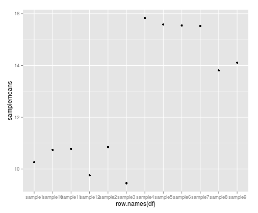
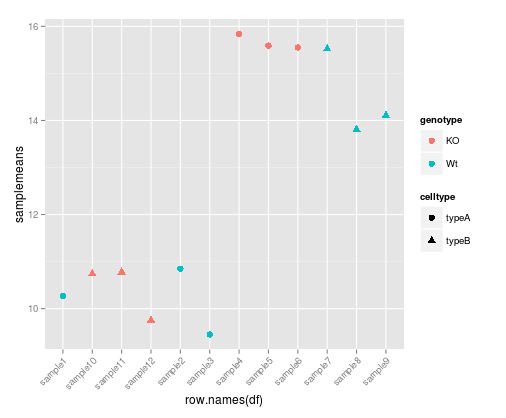
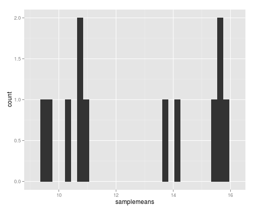
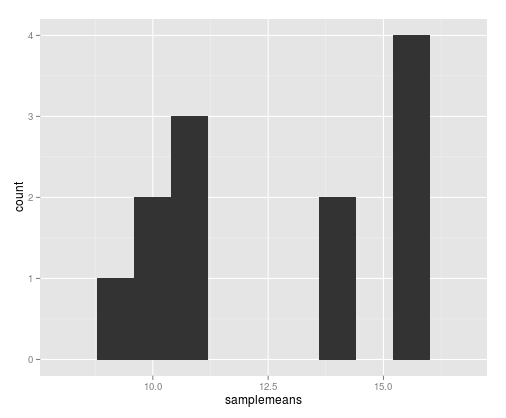

## Learning Objectives 
* Generating simple statistics in R
* Applying functions to multiple rows/columns of a matrix
* Visualizing data using basic plots in R
* Advanced plots (introducing `ggplot`)
* Writing images (and other things) to file


## Calculating simple statistics

Let's take a closer look at our data. Each column represents a sample in our experiment, and each sample has ~38K values corresponding to the expression of different transcripts. Suppose we wanted to compute the average value for a sample, or the minimum and maximum values? As mentioned previously, R is used for statistical computing therefore many of the base functions involve mathematical operations. The R base package provides many built-in functions such as `mean`, `median`, `min`, `max`, and `range`, just to name a few. Try computing the mean for "sample1" (_Hint: apply what you have learned previously on indexing_)  

	mean(rpkm_ordered[,'sample1'])


> ### Missing values
> By default, all **R functions operating on vectors that contains missing data will return NA**. It's a way to make sure that users know they have missing data, and make a conscious decision on how to deal with it. When dealing with simple statistics like the mean, the easiest way to ignore `NA` (the missing data) is to use `na.rm=TRUE` (`rm` stands for remove). 
> In some cases, it might be useful to remove the missing data from the vector. For this purpose, R comes with the function `na.omit` to generate a vector that has NA's removed. For some applications, it's useful to keep all observations, for others, it might be best to remove all observations that contain missing data. The function
`complete.cases()` returns a logical vector indicating which rows have no missing values. 


Let's test out a few other functions:

```r
# Maximum
max(rpkm_ordered[,'sample1'])

# Minimum
min(rpkm_ordered[,'sample1'])
```


## The `apply` Function
To obtain mean values for all samples we can use `mean` on each column individually, but there is also an easier way to go about it. The `apply` family of functions keep you from having to write loops (R is bad at looping) to perform some sort of operation on every row or column of a data matrix or a data frame. The family includes several functions, each differing slightly on the inputs or outputs.


```r
base::apply             Apply Functions Over Array Margins
base::by                Apply a Function to a Data Frame Split by Factors
base::eapply            Apply a Function Over Values in an Environment
base::lapply            Apply a Function over a List or Vector
base::mapply            Apply a Function to Multiple List or Vector Arguments
base::rapply            Recursively Apply a Function to a List
base::tapply            Apply a Function Over a Ragged Array
```

We will be using `apply` in our examples today, but do take a moment on your own to explore the many options that are available. The `apply` function returns a vector or array or list of values obtained by applying a function to margins of an array or matrix. We know about vectors/arrays and functions, but what are these “margins”? Margins are referring to either the rows (denoted by 1), the columns (denoted by 2) or both (1:2). By “both”, we mean  apply the function to each individual value. 

Let's try this to obtain mean expression values for each sample in our RPKM matrix:

	samplemeans <- apply(rpkm_ordered, 2, mean) 


***

**Exercise**

NEEDS TO BE ADDED

***


## Basic plots in R

The mathematician Richard Hamming once said, "The purpose of computing is insight, not numbers", and the best way to develop insight is often to visualize data. Visualization deserves an entire lecture (or course) of its own, but we can explore a few features of R's base plotting package.

When we are working with large sets of numbers it can be useful to display that information graphically. R has a number of built-in tools for basic graph types such as hisotgrams, scatter plots, bar charts, boxplots and much [more](http://www.statmethods.net/graphs/). We'll test a few of these out here on our `samplemeans` vector, but first we will create a combined data frame that maps our metadata to the sample mean values.


```r
# Create a combined data frame
all(rownames(metadata) == names(samplemeans)) # sanity check for sample order
df <- cbind(metadata, samplemeans) 
```


### Scatterplot
Let's start with a **scatterplot**. A scatter plot provides a graphical view of the relationship between two sets of numbers. We don't have a variable in our metadata that is a continous variable, so there is nothing to plot it against but we can plot the values against their index values just to demonstrate the function.


```r
plot(samplemeans)
```

  

Each point represents a sample and the value on the x-axis is the sample number, where the values on the y-axis correspond to the average expression for that sample. For any plot you can customize many features of your graphs (fonts, colors, axes, titles) through [graphic options](http://www.statmethods.net/advgraphs/parameters.html)
We can change the shape of the data point using `pch`.


```r
plot(samplemeans, pch=8)
```

 

We can add a title to the plot by assigning a string to `main`


```r
plot(samplemeans, pch=8, main="Scatter plot of mean values")
```

  

## Barplot
To visualize sample means, a **barplot**  would be much more useful. We can use `barplot` to draw a single bar representing each sample and the height indicates the average expression level. 


```r
barplot(samplemeans)
```

  

The sample names appear to be too large for the plot, we can change that by changing the `cex.names` value. 


```r
barplot(samplemeans, cex.names=0.5)
```

  

The names are too small to read. Alternatively, we can also just change the names to be numeric values and keep the same size.


```r
barplot(samplemeans, names.arg=c(1:12)) # supply numbers as labels
```

  

We can also flip the axes so that the plot is projected horizontally.


```r
barplot(samplemeans, names.arg=c(1:12), horiz=TRUE) 
```

  

## Histogram
If we are interested in an overall distribution of values, a **histogram** is a plot very commonly used. It plots the frequencies that data appears within certain ranges. To plot a histogram of the data use the `hist` command:


```r
hist(samplemeans)
```

  

The range of values for sample means is 22 to 39. As you can see R will automatically calculate the intervals to use. There are many options to determine how to break up the intervals. Let's increase the number of breaks to see how that changes the plot:


```r
hist(samplemeans, xlab="Mean expression level", main="", breaks=20) 
```

  

Similar to the other plots we can tweak the aesthetics. Let's color in the bar and remove the borders:


```r
hist(samplemeans, xlab="Mean expression level", main="", col="darkgrey", border=FALSE) 
```

  

##Boxplot

Using addiitonal sample information from our metadata, we can use plots to compare values between the two different celltypes 'typeA' and 'typeB' using a **boxplot**. A boxplot provides a graphical view of the median, quartiles, maximum, and minimum of a data set. 


```r
# Boxplot
boxplot(samplemeans~celltype, df)
```

  

Similar to the plots above, we can pass in arguments to add in extras like plot title, axis labels and colors.


```r
boxplot(samplemeans~celltype, df,  col=c("blue","red"), main="Average expression differences between celltypes", ylab="Expression")
```

  


***

**Exercise**

NEED TO ADD EXERCISE

***

## Advanced figures (`ggplot2`)


More recently, R users have moved away from base graphic options and towards a plotting package called [`ggplot2`](http://docs.ggplot2.org/) that adds a lot of functionality to the basic plots seen above. The syntax takes some getting used to but it's extremely powerful and flexible. We can start by re-creating some of the above plots but using ggplot functions to get a feel for the syntax.

`ggplot2` is best used on data in the `data.frame` form, so we will will work with `df` for the following figures. Let's start by loading the `ggplot2` library.

```{r}
library(ggplot2)
```

The `ggplot()` function is used to initialize the basic graph structure, then we add to it. The basic idea is that you specify different parts of the plot, and add them together using the `+` operator.

We will start with a blank plot and will find that you will get an error, because you need to add layers.

```{r, eval=FALSE}
ggplot(df) # note the error 
```

Geometric objects are the actual marks we put on a plot. Examples include:

* points (`geom_point`, for scatter plots, dot plots, etc)
* lines (`geom_line`, for time series, trend lines, etc)
* boxplot (`geom_boxplot`, for, well, boxplots!)

A plot **must have at least one geom**; there is no upper limit. You can add a geom to a plot using the + operator

```{r, eval=FALSE}
ggplot(df) +
  geom_point() # note what happens here
```

Each type of geom usually has a **required set of aesthetics** to be set, and usually accepts only a subset of all aesthetics --refer to the geom help pages to see what mappings each geom accepts. Aesthetic mappings are set with the aes() function. Examples include:

* position (i.e., on the x and y axes)
* color ("outside" color)
* fill ("inside" color) shape (of points)
* linetype
* size

To start, we will add position for the x- and y-axis since `geom_point` requires mappings for x and y, all others are optional.

```{r, fig.align='center'}
ggplot(df) +
     geom_point(aes(x = row.names(df), y= samplemeans))
```

  

The labels on the x-axis are quite hard to read. To do this we need to add an additional theme layer. The ggplot2 `theme` system handles non-data plot elements such as:

* Axis labels
* Plot background
* Facet label backround
* Legend appearance

There are built-in themes we can use, or we can adjust specific elements. For our figure we will change the x-axis labels to be plotted on a 45 degree angle with a small horizontal shift to avoid overlap. We will also add some additional aesthetics by mapping them to other variables in our dataframe. _For example, the color of the points will reflect the genotype and the shape will reflect celltype._ The size of the points can be adjusted within the `geom_point` but does not need to be included in `aes()` since the value is not mapping to a variable.

```{r, fig.align='center'}
ggplot(metadata) +
  geom_point(aes(x = row.names(df), y= samplemeans, color = genotype, shape = celltype), size = rel(3.0)) +
  theme(axis.text.x = element_text(angle=45, hjust=1))
```

  


## Histogram

To plot a histogram we require another geometric object `geom_bar`, which requires a statistical transformation. Some plot types (such as scatterplots) do not require transformations, each point is plotted at x and y coordinates equal to the original value. Other plots, such as boxplots, histograms, prediction lines etc. need to be transformed, and usually has a default statistic that can be changed via the `stat_bin` argument. 

```{r, eval=FALSE}
ggplot(df) +
  geom_bar(aes(x = samplemeans))
  
```

  


Try plotting with the default value and compare it to the plot using the binwidth values. How do they differ?

```{r, fig.align='center'}
ggplot(df) +
  geom_bar(aes(x = samplemeans), stat = "bin", binwidth=0.8)
  
```

  


### Barplot
For a barplot, we also use the geometric object `geom_bar` except we need to change the `stat` argument to `identity` to use the actual values. Since we don't have an x variable, we need to specify the row names as our index so each sample is plotted on its own. For `fill` you can use `genotype` or `celltype` and see how the plot changes. This time we also have additional layers to specify the labels for the x- and y-axis and a main title for the plot.


```r
ggplot(data=df, aes(x=row.names(df), y=samplemeans, fill=genotype)) +
  geom_bar(colour="black", stat="identity") +
  ggtitle('Average expression for each sample') +
  xlab('') +
  ylab('Mean expression') +
  theme(plot.title = element_text(size = rel(2.0)),
        axis.title = element_text(size = rel(1.5)),
        axis.text = element_text(size = rel(1.25)),
        axis.text.x = element_text(angle=45, vjust=0.5, hjust=0.6, size = rel(1.25)))
```

  


## Boxplot

Now that we have all the required information for plotting with ggplot2 let's try plotting a boxplot similar to what we had done using the base plot functions at the start of this lesson. We can add some additional layers to include a plot title and change the axis labels. Explore the code below and all the different layers that we have added to understand what each layer contributes to the final graphic.


```r
ggplot(data=df, aes(x= genotype, y=samplemeans, fill=celltype)) + 
  geom_boxplot() + 
  ggtitle('Genotype differences in average gene expression') +
  xlab('Genotype') +
  ylab('Mean expression') +
  theme(plot.title = element_text(size = rel(2.0)),
        axis.title = element_text(size = rel(1.5)),
        axis.text = element_text(size = rel(1.25)))
```

 


We have only scratched the surface here. To learn more, see the [ggplot reference site](http://docs.ggplot2.org/), and Winston Chang's excellent [Cookbook for R](http://wiki.stdout.org/rcookbook/Graphs/) site. Though slightly out of date, [ggplot2: Elegant Graphics for Data Anaysis](http://www.amazon.com/ggplot2-Elegant-Graphics-Data-Analysis/dp/0387981403) is still the definative book on this subject.


***

**Exercise**

NEED TO ADD EXERCISE FOR GGPLOT

***

## Writing figures to file

There are two ways in which figures and plots can be output to a file (rather than simply displaying on screen). The first (and easiest) is to export directly from the RStudio 'Plots' panel, by clicking on `Export` when the image is plotted. This will give you the option of `png` or `pdf` and selecting the directory to which you wish to save it to. The second option is to use R functions in the console, allowing you the flexibility to specify parameters to dictate the size and resolution of the output image. Some of the more popular formats include `pdf()`, `png`.

Initialize a plot that will be written directly to a file using `pdf`, `png` etc. Within the function you will need to specify a name for your image, and the with and height (optional). Then create a plot using the usual functions in R. Finally, close the file using the `dev.off()` function. There are also `bmp`, `tiff`, and `jpeg` functions, though the jpeg function has proven less stable than the others.


```r
pdf("figure/barplot.pdf")
ggplot(data=df, aes(x=row.names(df), y=samplemeans, fill=genotype)) +
  geom_bar(colour="black", stat="identity") +
  ggtitle('Average expression for each sample') +
  xlab('') +
  ylab('Mean expression') +
  theme(plot.title = element_text(size = rel(2.0)),
        axis.title = element_text(size = rel(1.5)),
        axis.text = element_text(size = rel(1.25)),
        axis.text.x = element_text(angle=45, vjust=0.5, hjust=0.6, size = rel(1.25)))
dev.off()
```


---
*The materials used in this lesson is adapted from work that is Copyright © Data Carpentry (http://datacarpentry.org/). 
All Data Carpentry instructional material is made available under the [Creative Commons Attribution license](https://creativecommons.org/licenses/by/4.0/) (CC BY 4.0).*
