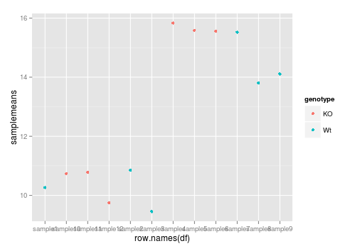
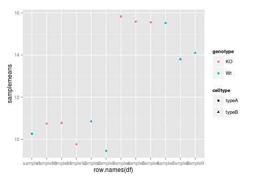
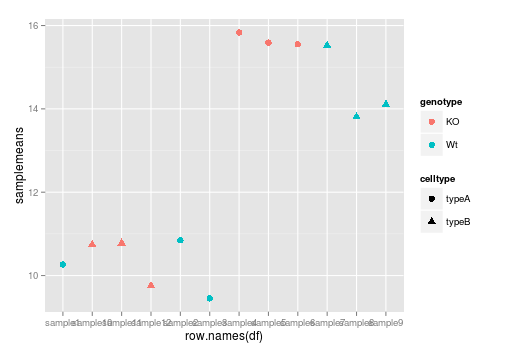
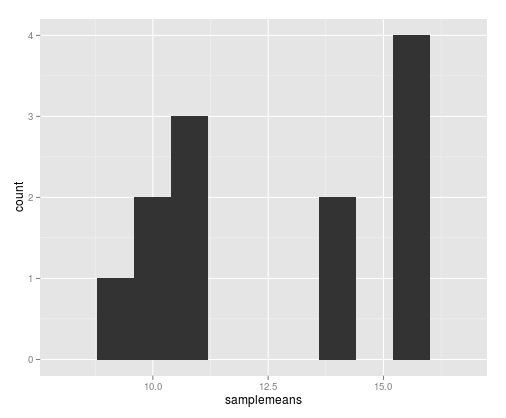

## Learning Objectives 
* Advanced plots (introducing `ggplot`)
* Exporting images to file


## Advanced figures (`ggplot2`)


More recently, R users have moved away from base graphic options and towards a plotting package called [`ggplot2`](http://docs.ggplot2.org/) that adds a lot of functionality to the basic plots seen in the previous lesson. The syntax takes some getting used to but it's extremely powerful and flexible. We can start by re-creating some of the above plots but using ggplot functions to get a feel for the syntax.

`ggplot2` is best used on data in the `data.frame` form, so we will will work with `df` for the following figures. Let's start by loading the `ggplot2` library.

```{r}
library(ggplot2)
```

The `ggplot()` function is used to **initialize the basic graph structure**, then we add to it. The basic idea is that you specify different parts of the plot, and add them together using the `+` operator.

We will start with a blank plot and will find that you will get an error, because you need to **add layers**.

```{r, eval=FALSE}
ggplot(df) # note the error 
```

**Geometric objects** are the actual marks we put on a plot. Examples include:

* points (`geom_point`, for scatter plots, dot plots, etc)
* lines (`geom_line`, for time series, trend lines, etc)
* boxplot (`geom_boxplot`, for, well, boxplots!)

A plot **must have at least one geom**; there is no upper limit. You can add a geom to a plot using the + operator

```{r, eval=FALSE}
ggplot(df) +
  geom_point() # note what happens here
```

Each type of geom usually has a **required set of aesthetics** to be set, and usually accepts only a subset of all aesthetics --refer to the geom help pages to see what mappings each geom accepts. Aesthetic mappings are set with the aes() function. Examples include:

* position (i.e., on the x and y axes)
* color ("outside" color)
* fill ("inside" color) shape (of points)
* linetype
* size

To start, we will add position for the x- and y-axis since `geom_point` requires mappings for x and y, all others are optional.

```{r, fig.align='center'}
ggplot(df) +
     geom_point(aes(x = row.names(df), y= samplemeans))
```

  


Now that we have the required aesthetics, let's add some extras like color to the plot. We can `color` the points on the plot based on genotype, by specifying the column of information in our data frame:

```{r, fig.align='center'}
ggplot(metadata) +
  geom_point(aes(x = row.names(df), y= samplemeans, color = genotype)) 
```

  


Alternatively, we could color based on celltype. If we wanted both celltype and genotype identified on the plot, the `shape` aesthetic would allow us to assign the shape of data point. Add in `shape = celltype` to your aesthetic and see how it changes your plot:

```{r, fig.align='center'}
ggplot(metadata) +
  geom_point(aes(x = row.names(df), y= samplemeans, color = genotype, shape = celltype)) 
```

  


The size of the data points are quite small. We can adjust within the `geom_point()` but does not need to be included in `aes()` since we are specifying how large we want the data points, rather than mapping it to a variable.


```{r, fig.align='center'}
ggplot(metadata) +
  geom_point(aes(x = row.names(df), y= samplemeans, color = genotype, shape = celltype), size = rel(3.0)) 
```

  

The labels on the x-axis ticks are also quite hard to read. To do this we need to add an additional **theme layer**. The ggplot2 `theme` system handles non-data plot elements such as:

* Axis label aesthetics
* Plot background
* Facet label backround
* Legend appearance

There are built-in themes we can use, or we can adjust specific elements. For our figure we will change the x-axis labels to be plotted on a 45 degree angle with a small horizontal shift to avoid overlap.

 
```{r, fig.align='center'}
ggplot(metadata) +
  geom_point(aes(x = row.names(df), y= samplemeans, color = genotype, shape = celltype), size = rel(3.0)) +
  theme(axis.text.x = element_text(angle=45, hjust=1))
```

  


### Exporting figures to file

There are two ways in which figures and plots can be output to a file (rather than simply displaying on screen). The first (and easiest) is to export directly from the RStudio 'Plots' panel, by clicking on `Export` when the image is plotted. This will give you the option of `png` or `pdf` and selecting the directory to which you wish to save it to. 


The second option is to use R functions in the console, allowing you the flexibility to specify parameters to dictate the size and resolution of the output image.  In R’s terminology, output is directed to a particular output device and that dictates the output format that will be produced.  A device must be created or “opened” in order to receive graphical output and, for devices that create a file
on disk, the device must also be closed in order to complete the output.

Let's print our scatterplot to a pdf file format. First you need to initialize a plot using a function which specifies the graphical format you intend on creating i.e.`pdf()`, `png()`, `tiff()` etc. Within the function you will need to specify a name for your image, and the with and height (optional). This will open up the device that you wish to write to:

	pdf("figure/scatterplot.pdf")


Then we plot the image to the device, using the ggplot scatterplot that we just created. Finally, close the file using the `dev.off()` function. There are also `bmp`, `tiff`, and `jpeg` functions, though the jpeg function has proven less stable than the others.

```
ggplot(metadata) +
  geom_point(aes(x = row.names(df), y= samplemeans, color = genotype, shape = celltype), size = rel(3.0)) +
  theme(axis.text.x = element_text(angle=45, hjust=1))

dev.off()
```


***

**Exercise**

1. The current axis labels default to what we gave as input to `geom_point`. We can change this by adding additional layers called `xlab()` and `ylab()` for the x- and y-axis, respectively. Add these layers to the current plot such that the x-axis is labeled "samples" and the y-axis is labeled "mean expression".
2. Use the `ggtitle` layer to add a title to your plot.
3. Export this image to a pdf file called "revised_scatterplot.pdf".

***


## Histogram

To plot a histogram we require another type of geometric object `geom_bar`, which requires a statistical transformation. Some plot types (such as scatterplots) do not require transformations, each point is plotted at x and y coordinates equal to the original value. Other plots, such as boxplots, histograms, prediction lines etc. need to be transformed, and usually has a default statistic that can be changed via the `stat_bin` argument. 

```{r, eval=FALSE}
ggplot(df) +
  geom_bar(aes(x = samplemeans))
  
```

  


Try plotting with the default value and compare it to the plot using the binwidth values. How do they differ?

```{r, fig.align='center'}
ggplot(df) +
  geom_bar(aes(x = samplemeans), stat = "bin", binwidth=0.8)
  
```

  


### Barplot
For a barplot, we also use the geometric object `geom_bar` except we need to change the `stat` argument to `identity` to use the actual values. Since we don't have an x variable, we need to specify the row names as our index so each sample is plotted on its own. For `fill` you can use `genotype` or `celltype` and see how the plot changes. This time we also have additional layers to specify the labels for the x- and y-axis and a main title for the plot.


```r
ggplot(data=df, aes(x=row.names(df), y=samplemeans, fill=genotype)) +
  geom_bar(colour="black", stat="identity") +
  ggtitle('Average expression for each sample') +
  xlab('') +
  ylab('Mean expression') +
  theme(plot.title = element_text(size = rel(2.0)),
        axis.title = element_text(size = rel(1.5)),
        axis.text = element_text(size = rel(1.25)),
        axis.text.x = element_text(angle=45, vjust=0.5, hjust=0.6, size = rel(1.25)))
```

  


## Boxplot

Now that we have all the required information for plotting with ggplot2 let's try plotting a boxplot similar to what we had done using the base plot functions at the start of this lesson. We can add some additional layers to include a plot title and change the axis labels. Explore the code below and all the different layers that we have added to understand what each layer contributes to the final graphic.


```r
ggplot(data=df, aes(x= genotype, y=samplemeans, fill=celltype)) + 
  geom_boxplot() + 
  ggtitle('Genotype differences in average gene expression') +
  xlab('Genotype') +
  ylab('Mean expression') +
  theme(plot.title = element_text(size = rel(2.0)),
        axis.title = element_text(size = rel(1.5)),
        axis.text = element_text(size = rel(1.25)))
```

 


---
*The materials used in this lesson is adapted from work that is Copyright © Data Carpentry (http://datacarpentry.org/). 
All Data Carpentry instructional material is made available under the [Creative Commons Attribution license](https://creativecommons.org/licenses/by/4.0/) (CC BY 4.0).*
